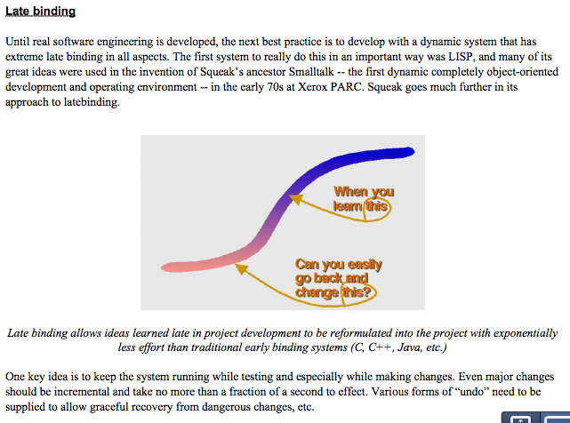

# Object Oriented Programming is an expensive disaster which must end

(written by lawrence, however indented passages are often quotes)

The [No True Scotsman fallacy](https://en.wikipedia.org/wiki/No_true_Scotsman) leads to arguments like this:

> Person A: “No Scotsman ever steals.”
> 
> Person B: “I know of a Scotsman who stole.”
> 
> Person A: “No True Scotsman would ever steal.”

Person A is thus protected from the harmful effects of new information. New information is dangerous, as it might cause someone to change their mind. New information can be rendered safe simply by declaring it to be invalid. Person A believes all Scotsman are brave and honorable, and you can not convince them otherwise, for any counter-example you bring up is of some degraded Untrue Scotsman, which has no bearing on whatever they think of True Scotsman. And this is my experience whenever I argue against Object Oriented Programming (OOP): no matter what evidence I bring up for consideration, it is dismissed as irrelevant. If I complain that Java is verbose, I’m told that True OOP Programmers let the IDE take care of some of the boilerplate, or perhaps I am told that Scala is better. If I complain that Scala involves too much ceremony, I’m told that Ruby lacks ceremony. If I complain about the dangers of monkey-patching in Ruby, I’m told that True OOP Programmers know how to use the meta-programming to their advantage, and if I can’t do it then I am simply incompetent. I should use a language that is more pure, or a language that is more practical, I should use a language that has compile-time static data-type checking, or I should use a language that gives me the freedom of dynamic typing. If I complain about bugginess, I’m told that those specific bugs have been fixed in the new version, why haven’t I upgraded, or I’m told there is a common workaround, and I’m an idiot if I didn’t know about it. If I complain that the most popular framework is bloated, I’m told that no one uses that framework any more. No True OOP Programmer ever does whatever it is that I’m complaining about.

There are many beautiful ideas that people associate with OOP. I am going to show 2 things:

1. compared to other languages (lisps, functional languages, etc) OOP languages have no unique strengths
2. compared to other languages (lisps, functional languages, etc) OOP languages inflict a heavy burden of unneeded complexity

Those features which are potentially good (data hiding, contract enforcement, polymorphism) are not unique to OOP and, in fact, stronger versions of these things are available in non-OOP languages. Those features that are unique to OOP (dependency injection, instantiation) are awful and exist only because OOP is awful.

I am taking an ecumenical, universalist approach to OOP. Below I will refer to all of these languages as OOP: C++, Java, Scala, PHP, Ruby, and Javascript. Is that fair? I know, from personal experience, some proponents of Java will complain that Ruby and PHP lack compile time data-type checking and therefore should not be considered OOP. And I know, from personal experience, some proponents of Ruby will argue that in Ruby everything is an object, whereas Java still has non-object primitives (such as integers), and therefore Ruby is more of an OOP language than Java. I know that some critics of PHP will argue that OOP features were bolted on to PHP and it should not be taken seriously as an OOP language. I know some people will point out that Scala is multi-paradigm and it is as easy to work in the “functional paradigm” with Scala as it is easy to work with the object oriented paradigm.

Given the diversity of the languages, and the lack of a standard definition, is it meaningful to talk about OOP at all? I would say yes. The need is urgent. OOP may be a poorly defined, amorphous concept, but it absolutely dominates the tech industry. Many software developers, and many companies, feel that OOP is the only reasonable way to develop software today. Any one who argues against OOP is immediately made conscious of the fact that they are arguing against the “conventional wisdom” of the industry.

I run into this when I go to a job interview. It does not matter if I interview for a Ruby job, or a Java job, or a PHP job, the job interviewers ask me if I know what OOP is. They ask me to define “encapsulation” and “polymorphic dispatch”. These are standard questions, to which I am expected to give the standard answers. And when they ask me “What are the benefits of OOP?” I find myself wanting to give an awkwardly long answer, which consists “These are the 12 things that are supposed to be the benefits of OOP, but really OOP has no unique strengths.” And so I am writing this essay, and in the future, when I’m asked questions like this at a job interview, I’ll simply directly people to what I have written here.

Does any of this really matter? You could argue that I’m wasting my time, that I am writing a very long essay that merely engages in a bunch of semantic hair-splitting that benefits no one. But I would suggest that muddled definitions lead to muddled thinking, in the manner that Orwell described: 

> A man may take to drink because he feels himself to be a failure, and then fail all the more completely because he drinks. It is rather the same thing that is happening to the English language. It becomes ugly and inaccurate because our thoughts are foolish, but the slovenliness of our language makes it easier for us to have foolish thoughts. The point is that the process is reversible. Modern English, especially written English, is full of bad habits which spread by imitation and which can be avoided if one is willing to take the necessary trouble.

On that basis, I would like to think that I do some good, to the extent that I’m able to take on the broad range of ideas associated with OOP.

This essay is long, and it would be even longer if I carefully qualified every sentence about OOP. Please note that, below, when I refer to a multi-paradigm language, such as Scala, as an OOP language, I am specifically referring to the OOP qualities in that language. And I would like you to ask yourself, if you use a multi-paradigm language to write in the “functional” paradigm, are you actually gaining anything from the OOP qualities of that language? Could you perhaps achieve the same thing, more easily, using a language that is fundamentally “functional”, rather than object oriented?

On tech blogs and forums, there are a great many people who defend OOP, and who feel certain that they know what they are defending, despite the lack of any standard definition. Consider this remark by “millstone” on Hacker News: 

> This article, like many that cheer functional programming, falls into a certain cognitive bias, that prevents it from seeing what OO is good at.

What is OO good at? Apparently millstone thinks that OO is good at being dynamic. millstone then criticizes the fact that Haskel has static type checking, ignoring the fact that Java, C++, C# and many other OO languages all have static type checking: 

> Alan Kay wrote “The key in making great and growable systems is much more to design how its modules communicate rather than what their internal properties and behaviors should be.”
>
> To start to see what this means, consider the annoying String / Data.Text split in Haskell. String is very much in the “leave data alone” mindset, baring its guts as a [Char]. Now you’re stuck: you can’t change its representation, you can’t easily introduce Unicode, etc. This proved to be so rigid that an entirely new string type had to be introduced, and we’re still dealing with the fallout.
> 
> Great and growable systems! The large scale structure of our software, decomposed into modules, not just at a moment frozen in time, but in the future as well. We are tasked with thinking about relationships and communication.

millstone then quotes the original article, and then makes clear they are really talking about ” truly dynamic languages” and not OOP: 

> > To come up with a better solution [for dispatching], Haskell and Clojure take very different approaches, but both excel what any OO programmer is commonly used to.
>
> “Any OO programmer?” No way! OO as realized in truly dynamic languages exposes not just a fixed dispatch mechanism, but the machinery of dispatch itself, i.e. a metaobject protocol

There are plenty of OOP languages that have static data-type checking, and there are non-OOP languages that are dynamic, so millstone is not really talking about OOP at all, and yet millstone is certain that they know what OOP is. This is a problem that I run into fairly often: a fierce advocate of OOP who is using some idiosyncratic definition of OOP, which takes me completely off-guard. 

millstone then quotes this part of an essay by Alan Kay: 

Please note the irony here: millstone is quoting a passage that is critical of Java, and yet millstone is claiming this passage, about “late binding”, shows what OO is good at. By this definition, Java is not an OOP language, which would surely be a surprise to Java programmers.

Again, there are OOP languages that have don’t have late binding, and there are non-OOP languages that do have late binding. But for millstone, No True OOP Programmer would ever use a language with static data-type checking. To the extent that millstone is inventing a wholly idiosyncratic definition of OOP, their comments about OOP are wholly irrelevant to anyone else who wants to talk about OOP. And yet, in some sense, millstone is very common: I commonly run into software developers who have wholly idiosyncratic definitions of OOP. This can make it difficult to have a meaningful conversation.

How should we talk about a concept as amorphous as OOP? There is no standard definition, so the best we can do is survey a few different sources and gather up the main ideas. How should we conduct this survey? Two ways: first, a trip through history, listening to Alan Kay describe the roots of OOP, and then a look at what some current introductory materials are teaching beginners about the core ideas of OOP. 
